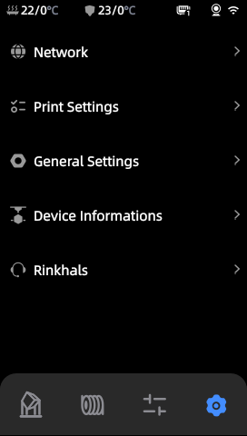
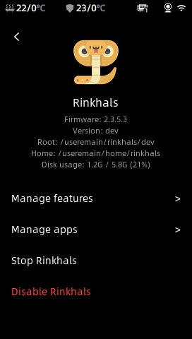
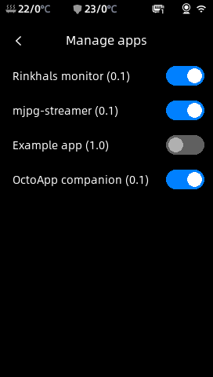

> [!CAUTION]
> **THE SOFTWARE IS PROVIDED "AS IS", WITHOUT WARRANTY OF ANY KIND. BY USING IT YOU TAKE ALL THE RISKS FOR YOUR ACTIONS**

> [!WARNING]
> **THIS FIRMWARE IS A WORK IN PROGRESS, DO NOT USE IT UNLESS YOU KNOW HOW TO USE LINUX AND HOW TO RECOVER OR UNBRICK YOUR PRINTER**

# Rinkhals

Rinkhals is a custom firmware for the Anycubic Kobra 3 3D printer. The goal of this project is to create a simple and safe overlay for the Kobra 3 firmware, adding some usefule features.
This firmware will likely not support all use cases, like running vanilla Klipper or your specific feature / plugin.

Here are some of the features I added:
- Mainsail, Fluidd and Moonraker (using nginx)
- USB camera support through Fluidd and Moonraker (mjpg-streamer)
- Print from Moonraker will show the print screen (moonraker-proxy)
- Access using SSH and ADB

This project is named after rinkhals. They are a sub-species of Cobras ... Kobra 3 ... Rinkhals 👏

The stock firmwares are available on a separate branch: https://github.com/jbatonnet/Rinkhals/tree/stock-firmwares

    

## Touch UI

After installation, Rinkhals provides a touch UI accessible from the printer screen when you tap the Settings icon, then tap Rinkhals.

This UI allows you to stop or disable Rinkhals, and to control what feature and or app is enabled. This will allow you to customize your experience and keep the printer memory as low as needed based on your situation.

    
    
    

## Apps system

An apps system is provided in Rinkhals. It allows for the users to easily add some features to their printer. Some default ones are provided and other are available on a separate repo: https://github.com/jbatonnet/Rinkhals.apps

Instructions on how to install or develop apps are on the other repo as well.

## How to install Rinkhals

You can install Rinkhals on top of other custom firmwares. Rinkhals only appends its loader to **start.sh**, so if it's the last instruction, it will start no matter what firmware you are using.

- Make sure your printer uses firmware 2.3.5.3 ([how to install firmware](https://github.com/jbatonnet/Rinkhals/wiki/Firmware#how-to-install-a-firmware))
    - Installation will simply fail without touching your printer if you are using some other version
- Format a USB drive as FAT32
- Create a directory named **aGVscF9zb3Nf**
- Download the version of Rinkhals you want to install
- Copy the **update.swu** file in the **aGVscF9zb3Nf** directory
- Plug the USB drive in the Kobra 3
- You should hear a beep, meaning the printer detected the update file
- After about 20 seconds (the time for the printer to prepare the update), you will see a progress bar on the screen
    - If the progress bar turns green and you ear 2 beeps, the pritner reboots and Rinkhals is installed
    - If the progress bar turns red and you ear 3 beeps, the installation failed but everyhting should still work as usual. You will then find more information on the **aGVscF9zb3Nf/install.log** file on the USB drive

    

## SWU tools

This repo contains some tools you can use **no matter what firmware you are using**. It is a set of scripts packaged in a SWU file.

They are available on this page: https://github.com/jbatonnet/Rinkhals/actions/workflows/build-swu-tools.yml

You can download the SWU file for the tool you want, copy it on a FAT32 USB drive in a **aGVscF9zb3Nf** directory, plug the USB drive in the Kobra and it just works.
You will ear two beeps, the second one will tell you that the tool completed its work. There is no need to reboot afterwards.

Here are the tools available:
- **SSH**: get a SSH server running on port **2222**, even on stock firmware
- **Backup partitions**: creates a dump of your userdata and useremain partition on the USB drive
- **Debug bundle**: creates a zip file with printer and configuration information on the USB drive to ease debugging

## Documentation / Known issues

The [wiki](https://github.com/jbatonnet/Rinkhals/wiki) is a collection of documentation, reverse engineering and notes about the printer and development, don't forget to [check it out](https://github.com/jbatonnet/Rinkhals/wiki)!

If your printer shows a 11407 error, check the wiki there: [See the wiki about error 11407](https://github.com/jbatonnet/Rinkhals/wiki/Firmware#my-printer-shows-a-11407-error)

## How to uninstall Rinkhals

### 1. Disable Rinkhals

**Method 1**: Create a .disable-rinkhals file on a USB drive or at this location: /useremain/rinkhals/.disable-rinkhals
This will prevent Rinkhals from starting.

**Method 2**: Factory reset might have done that already, but make sure your /userdata/app/gk/start.sh and /userdata/app/gk/restart_k3c.sh don't contain a # Rinkhals/begin section. If they do, remove the section between # Rinkhals/begin and # Rinkhals/end.

### 2. Reboot
Reboot once Rinkhals is disabled to make sure it didn't start, so you'll be able to remove the files.

### 3. Delete Rinkhals
Then you can delete the /useremain/rinkhals directory. That's it!

    

## Development

> [!WARNING]
> If you develop on Windows, like I'm doing, don't forget to disable Git's autocrlf function, as this repo contains Linux scripts running on Linux machines. 
> Run `git config core.autocrlf false` **BEFORE** cloning the repo

If you want to fully build this firmware yourself and avoid using the prebuilt binaries, Dockerfiles and build scripts are provided.

Now if you just want to tweak things and maybe fix some bugs or add new features, you will need either a Linux machine or a Windows machine with Docker.

Here are the steps: 
- Clone the repo or Download the zip
- Do your modifications
- Open a terminal at the root of the repo, and run: `docker run --rm -it -e KOBRA_IP=x.x.x.x -v .\build:/build -v .\files:/files --entrypoint=/bin/sh rclone/rclone:1.68.2 /build/deploy-dev.sh`

This will create a "dev" version on your printer. Using the script above will synchronize your workspace with your PC.
Now you can start/restart your updated "dev" version using SSH:
- `chmod +x /useremain/rinkhals/dev/start.sh`
- `/useremain/rinkhals/dev/start.sh`

I use VS Code for everything here, and it takes me about 30s~1m per iteration.

If you ever want to create a full SWU with your version, use the `build-swu.sh` script with Docker, and you'll get your SWU in build/dist/update.swu:
  `docker run --rm -it -e VERSION="yyyymmdd_nn" -v .\build:/build -v .\files:/files ghcr.io/jbatonnet/rinkhals/build /build/build-swu.sh`

And if you want to keep things even simpler, fork the repo, do your modifications and push them. I provided some GitHub Actions to build the SWU for you:
- Go there (on your fork): https://github.com/jbatonnet/Rinkhals/actions/workflows/build-swu.yml
- Click "Run workflow", select your branch
- The SWU will be built and added as an artifact to your workflow

If you're ever stuck, reboot, use the SSH SWU tool to regain SSH if you lost it, or reflash the last version if things don't work.

## Thanks

Thanks to the following projects/persons:
- utkabobr (https://github.com/utkabobr/DuckPro-Kobra3)
- systemik (https://github.com/systemik/Kobra3-Firmware)
- Anycubic for the cool printer and the few OSS items (https://github.com/ANYCUBIC-3D/Kobra)
- Icon created by Freepik - Flaticon (https://www.flaticon.com/free-icons/snake)
